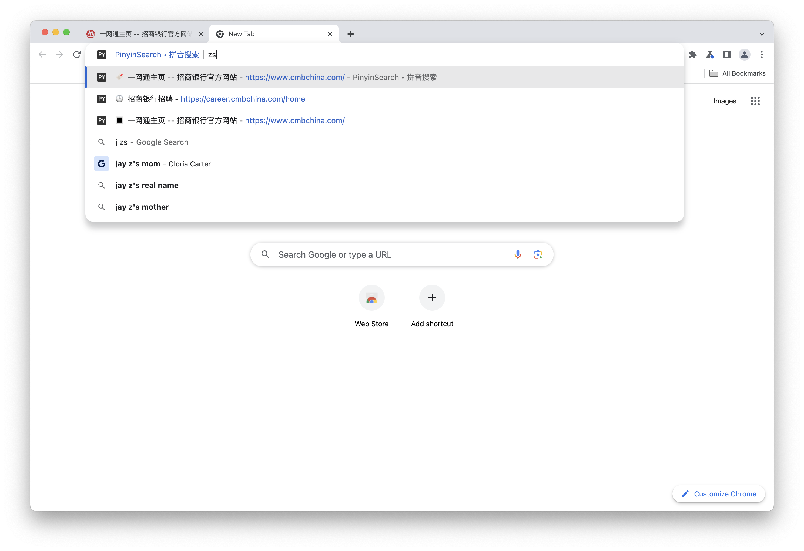

# Pinyin Search • 拼音搜索

Pinyin Search • 拼音搜索（[Chrome Web Store 地址](https://chrome.google.com/webstore/detail/pinyinsearch-%E2%80%A2-%E6%8B%BC%E9%9F%B3%E6%90%9C%E7%B4%A2/fejaoeigldmlmkplacjhhmbclogihako)），是一个支持拼音搜索的浏览器扩展，在地址栏输入`j`+`空格`，即可使用拼音搜索你的历史记录 🕒、书签 🔖、标签页 🔳，支持全拼、首字母、小鹤双拼。

另外，如果选中了搜索结果里的标签页 🔳，会自动跳转到对应的标签页。

## todo
- [x] 支持history、bookmark、tab搜索
- [x] 监听添加、删除、更新事件
- [x] 支持双拼
- [ ] popup 搜索
- [ ] try https://github.com/nextapps-de/flexsearch
- [ ] 网页全文搜索

# References

Forked from https://github.com/chibat/chrome-extension-typescript-starter